# 📝 Task Manager App


---

## 📌 Project Overview

**Task Manager** is a modern, production-ready mobile application designed to simplify daily task tracking and personal workflow management. Built with **Flutter** and engineered using **Feature-First Architecture**, the app seamlessly integrates with a backend REST API to perform real-time data sync, state persistence, and dynamic UI updates.

### 🌟 Key Architectural Highlights & Engineering Concepts
- **Feature-First Folder Structure:** Modules are isolated by features (`auth`, `dashboard`, `profile`, `create_task`, `task_details`) to maintain scalability and high code maintainability.
- **Secure JWT Authentication:** Implements token-based user authentication using `AuthController` and local persistence via `SharedPreferences`.
- **Robust Network Layer:** Powered by a centralized `ApiService` for seamless HTTP requests (`GET`, `POST`), complete with authorization headers and automatic session handling.
- **Dynamic Task Lifecycle (CRUD):** Complete task lifecycle management allowing users to create, filter (New, In Progress, Completed, Cancelled), update status via bottom sheets, and delete tasks.
- **Account Recovery Flow:** A step-by-step OTP-based email verification and password reset mechanism.
- **Sleek UI/UX Design:** Features custom loading skeletons, dynamic status counters, responsive custom text fields, and smooth modal bottom sheets built with `Google Fonts`.

---

## ✨ Core Features & API Mapping

| Feature | Screens & Widgets Involved | REST API Endpoint & Method | Description |
|---|---|---|---|
| **User Authentication** | `login_screen.dart`<br>`sign_up_screen.dart` | `POST` `/login`<br>`POST` `/registration` | Handles secure user sign-up and login. Stores bearer JWT tokens locally using `AuthController` via `SharedPreferences`. |
| **Password Recovery Flow** | `recover_verify_email_screen.dart`<br>`pin_verification_screen.dart`<br>`reset_password_screen.dart` | `GET` `/RecoverVerifyEmail/{email}`<br>`GET` `/RecoverVerifyOTP/{email}/{otp}`<br>`POST` `/RecoverResetPass` | Step-by-step account recovery process using 6-digit email OTP verification and password reset. |
| **Dashboard Overview** | `dashboard_screen.dart`<br>`dashboard_status_grid.dart`<br>`recent_task_list_section.dart` | `GET` `/taskStatusCount`<br>`GET` `/listTaskByStatus/New` | Shows status summary cards (New, In Progress, Completed, Cancelled) alongside recent task lists with loading skeletons. |
| **Task Management (CRUD)** | `add_new_task_bottom_sheet.dart`<br>`edit_task_bottom_sheet.dart`<br>`task_list_screen.dart`<br>`task_details_screen.dart` | `POST` `/createTask`<br>`GET` `/updateTaskStatus/{id}/{status}`<br>`GET` `/deleteTask/{id}` | Enables adding new tasks, filtering tasks by status, updating task progress, and deleting task items. |
| **Profile & Security** | `profile_screen.dart`<br>`edit_profile_screen.dart`<br>`change_password_bottom_sheet.dart` | `POST` `/profileUpdate` | Allows users to edit profile details (name, email, phone) and change login passwords dynamically. |

---

## 📸 Screenshots Showcase

### 1. Authentication & Onboarding
<p align="center">
  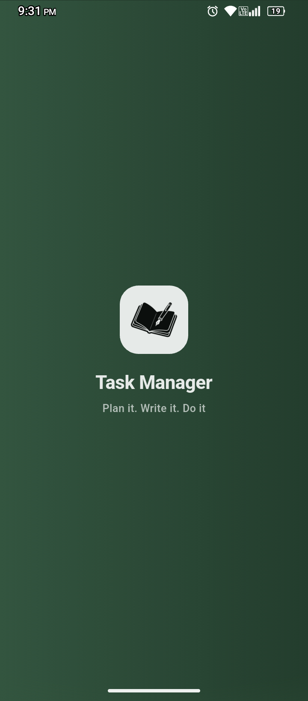
  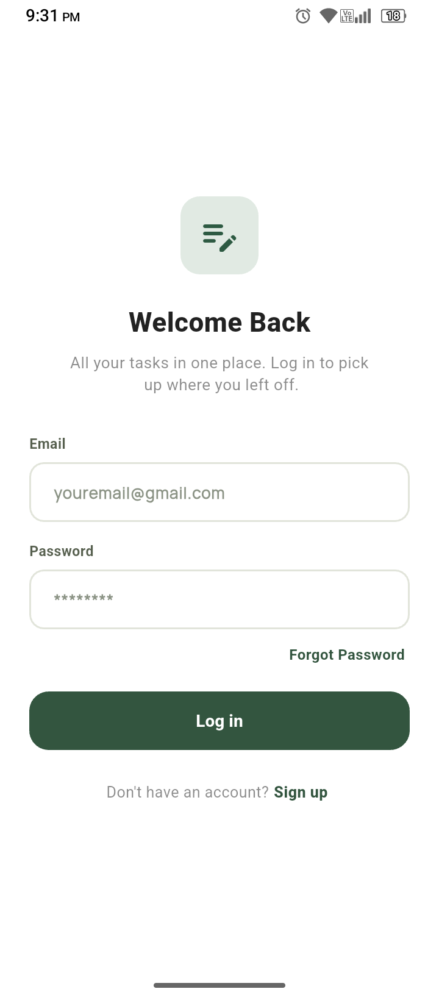
  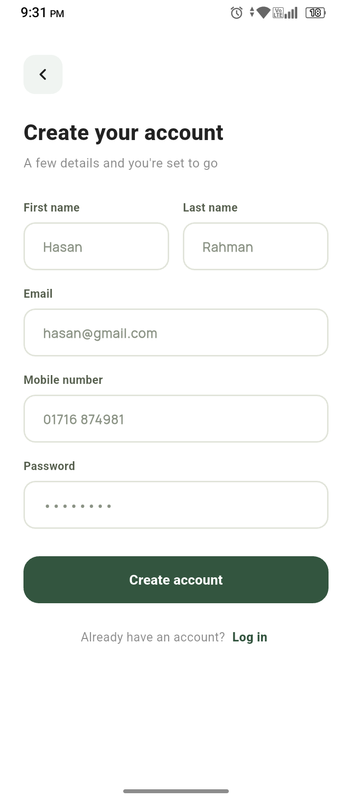
</p>

---

### 2. Password Recovery Sequence
<p align="center">
  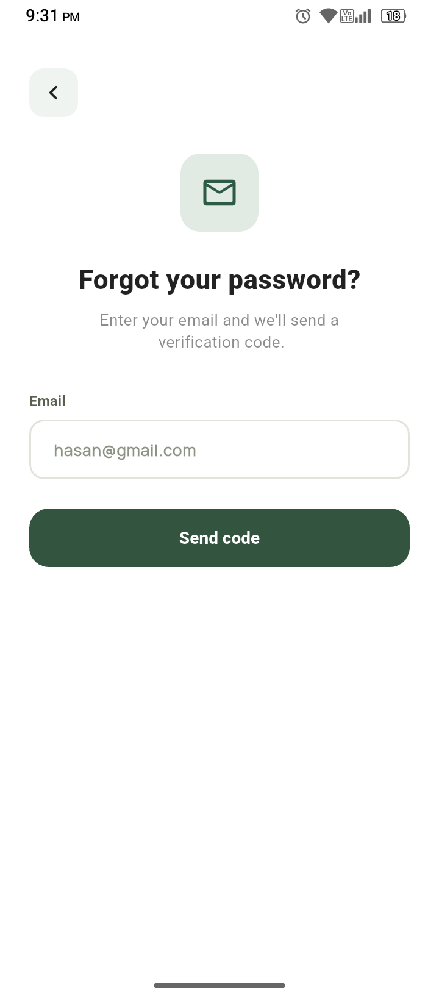
  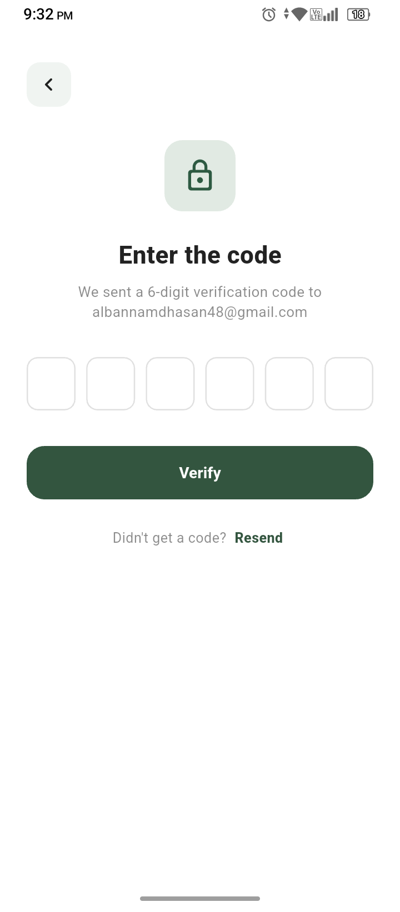
  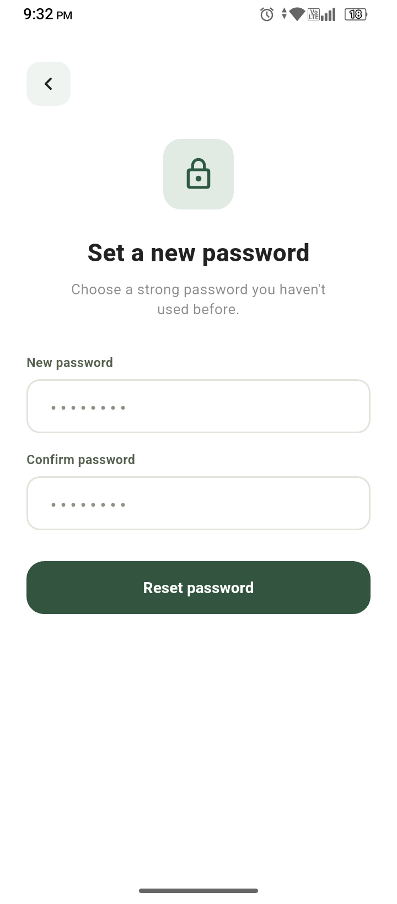
</p>

---

### 3. Dashboard & Task Management
<p align="center">
  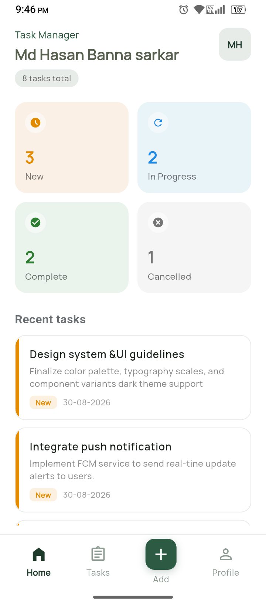
  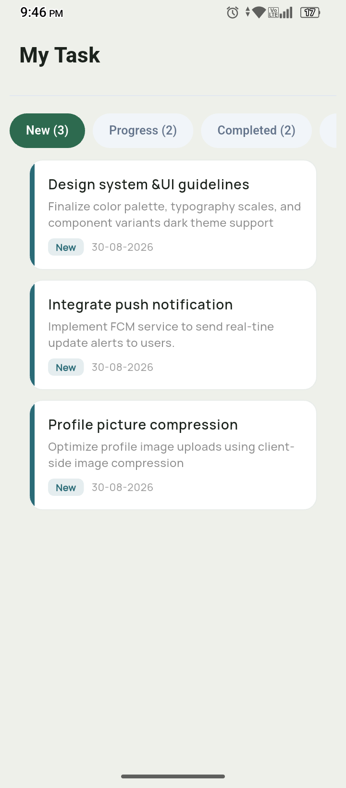
  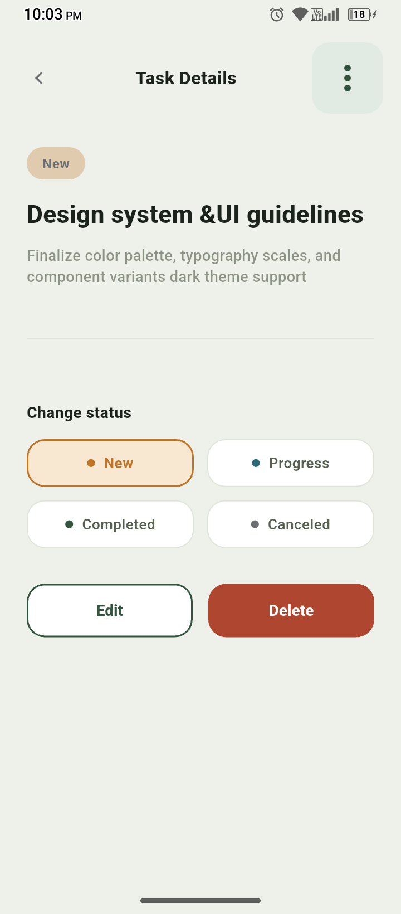
</p>

---

### 4. Dialogs & Action Sheets
<p align="center">
  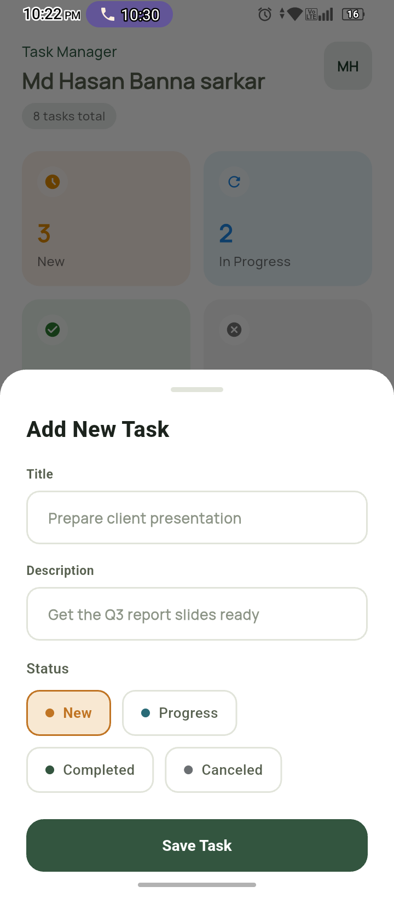
  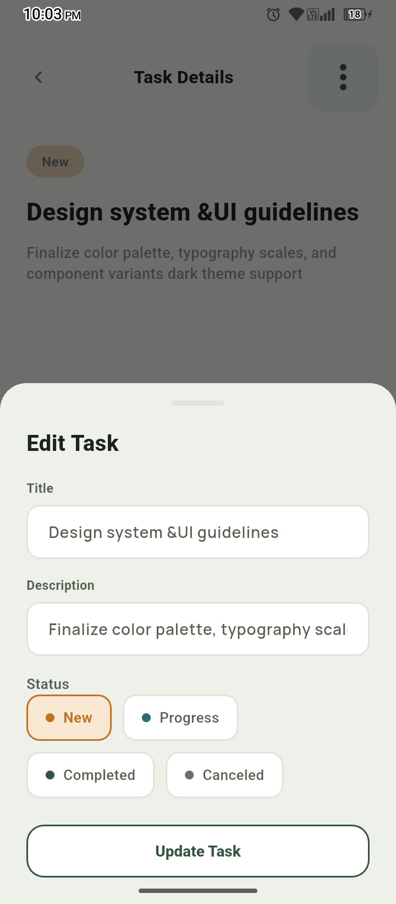
  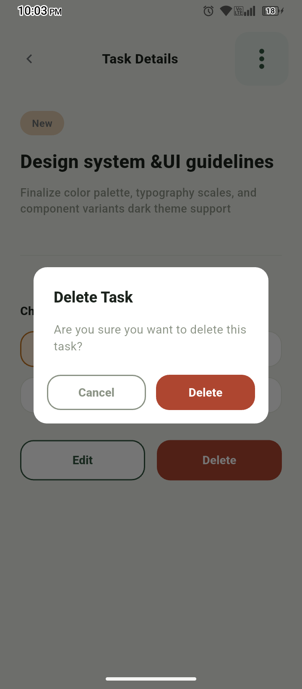
</p>

---

### 5. Profile & Settings
<p align="center">
  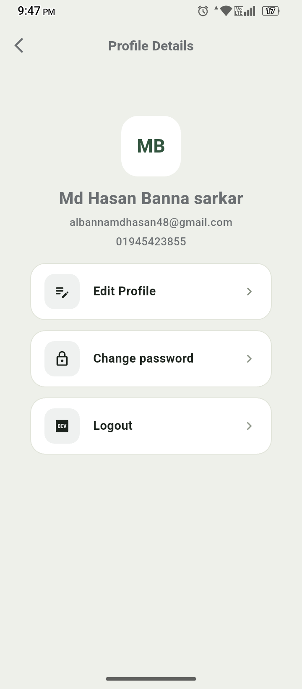
  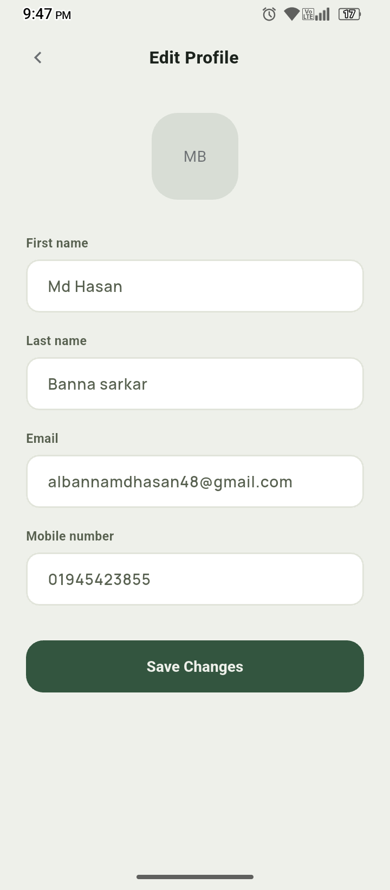
  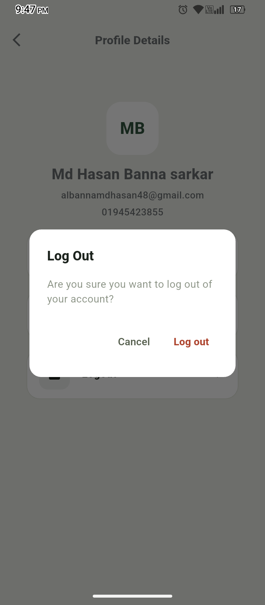
</p>

---

## 🛠️ Tech Stack & Dependencies

- **Framework & SDK:** Flutter (Dart SDK `>=3.0.0 <4.0.0`)
- **Networking & API:** `http: ^1.6.0`
- **Data Persistence:** `shared_preferences: ^2.5.5`
- **UI & Typography:** `google_fonts: ^8.2.1`, `cupertino_icons: ^1.0.8`
- **App Launcher & Splash:** `flutter_launcher_icons: ^0.13.1`, `flutter_native_splash: ^2.4.0`

---

## 📁 Project Structure

```text
task_manager_app/
├── lib/
│   ├── app/
│   │   ├── app.dart
│   │   └── theme/
│   │       └── app_theme.dart
│   ├── core/
│   │   ├── constants/
│   │   │   ├── app_helper.dart
│   │   │   └── app_urls.dart
│   │   ├── network/
│   │   │   └── api_service.dart
│   │   └── widgets/
│   │       ├── app_bottom_nav_bar.dart
│   │       ├── app_button.dart
│   │       ├── app_icon.dart
│   │       ├── app_icon_button.dart
│   │       ├── app_text.dart
│   │       ├── app_text_button.dart
│   │       ├── app_text_field.dart
│   │       ├── log_out_pop_up.dart
│   │       ├── profile_menu_helper.dart
│   │       └── screen_background.dart
│   ├── features/
│   │   ├── auth/
│   │   │   ├── controllers/
│   │   │   │   └── auth_controller.dart
│   │   │   └── screen/
│   │   │       ├── login_screen.dart
│   │   │       ├── pin_verification_screen.dart
│   │   │       ├── recover_verify_email_screen.dart
│   │   │       ├── reset_password_screen.dart
│   │   │       ├── sign_up_screen.dart
│   │   │       └── splash_screen.dart
│   │   ├── create_task/
│   │   │   └── add_new_task_bottom_sheet.dart
│   │   ├── dashboard/
│   │   │   ├── controllers/
│   │   │   │   └── task_controller.dart
│   │   │   ├── screen/
│   │   │   │   └── dashboard_screen.dart
│   │   │   └── widgets/
│   │   │       ├── dashboard_status_grid.dart
│   │   │       ├── error_empty_state.dart
│   │   │       ├── profile_header.dart
│   │   │       ├── recent_task_list_section.dart
│   │   │       ├── skeleton_loader_card.dart
│   │   │       ├── status_card.dart
│   │   │       └── task_item_card.dart
│   │   ├── profile/
│   │   │   ├── screens/
│   │   │   │   ├── change_password_bottom_sheet.dart
│   │   │   │   ├── edit_profile_screen.dart
│   │   │   │   └── profile_screen.dart
│   │   │   └── widgets/
│   │   │       └── profile_tile_widget.dart
│   │   ├── task_dashboard/
│   │   │   ├── screens/
│   │   │   │   └── task_list_screen.dart
│   │   │   └── widgets/
│   │   │       ├── task_empty_state_widget.dart
│   │   │       └── task_filter_chips.dart
│   │   └── task_details/
│   │       ├── components/
│   │       │   └── edit_task_bottom_sheet.dart
│   │       └── task_details_screen.dart
│___└── main.dart
